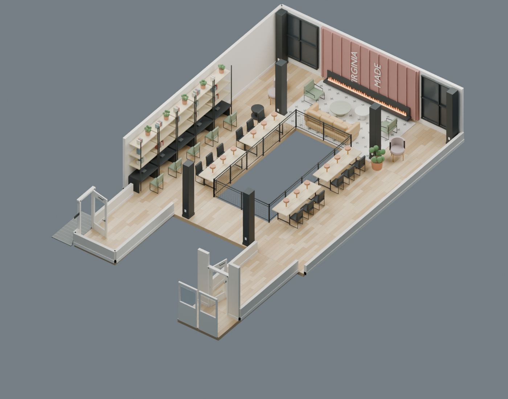

# Prepared Virginia lounge demo

A locally authored Blender model reviewed against `IMG_1343 2.MOV` (50.04 seconds),
with 21 reference frames spanning entrance, first walkway, fireplace seating, return
walkway, exit corridor, and the final double doors. The original footage stays local
and is not included in this repository. No Gemini or other external vision API is
called to load or rebuild this prepared scene.



The near-entry cross-passage connects both walkways, as clarified by the owner.
The model includes the furnished route around the railed opening, fireplace and
sofa area, library shelves, worktables and chairs, plant pots, window frames,
three labeled door assemblies, and independently hideable walls and ceilings.
The two glass leaves are shown open, matching their use during the filmed walkthrough.
The lower level and unfilmed continuation beyond the turning area are not modeled.

Dimensions and some furniture placements are visual estimates. The assumed entrance
door width is 3.5 ft (1.067 m). This is a prepared, stylized video-guided model, not an
automatic reconstruction result or a measured building survey. Ceilings and tall
foreground walls are hidden by the sandbox's default cutaway view; turn Cutaway off
to show them. Low wall sections retain legible corridor boundaries in cutaway view.

## Use

Start the existing backend and frontend, then click **Load prepared demo** in the
Reconstruction workspace. It opens an editable saved scan immediately. Repeated
clicks reuse an unedited copy with the same asset checksum. Edited copies remain
separate, and a changed bundled model creates a new version. When the exact original `IMG_1343 2.MOV` file is selected and **Reconstruct Video**
is clicked, its SHA-256 fingerprint selects this prepared model. A deliberately
paced ten-second sequence shows reference matching, geometry checks, furnishing
checks, asset loading, and Sandbox preparation. Every stage is labeled as a
prepared demo. Upload time is additional; this is not a ten-second AI reconstruction.
Renaming the original file still matches; a different or re-encoded video uses the
normal reconstruction pipeline. Captures and other videos are unaffected.

The entrance door is on the left side wall of the entry corridor, per the owner’s
correction. Its wall opening, mat, and trim move with it.

`scene.json.gz` is a validated portable scene with embedded GLB and semantic meshes.
`model.blend` is the editable Blender source. The endpoint also makes the GLB and
Blender file available through the scan's ordinary artifact download URLs. The
sandbox's Export JSON and Reset scene controls continue to work.

## Rebuild

From the repository root (replace `Blender` with your installed Blender executable):

```sh
Blender --background --factory-startup --disable-autoexec --python-exit-code 1 --python backend/scripts/demos/build_virginia_lounge.py -- /tmp/lounge-build
backend/.venv/bin/python backend/scripts/demos/package_lounge.py /tmp/lounge-build
Blender --background --factory-startup --disable-autoexec --python-exit-code 1 --python backend/scripts/demos/render_lounge.py -- /tmp/lounge-build
```

Inspect `overview.png`, `plan.png`, and `lounge.png` in the build directory before
replacing the bundled demo. Source scripts are in `backend/scripts/demos/`.
